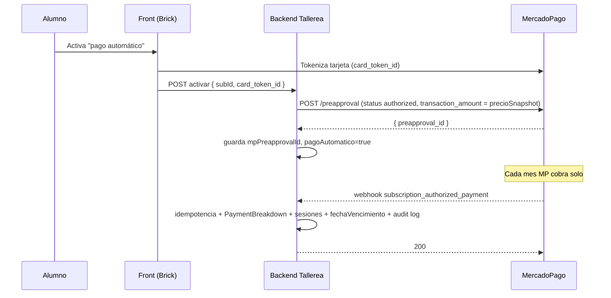

# Pago automático MercadoPago para talleres recurrentes

> Evaluación técnica, de viabilidad y plan de implementación.
> Fecha: 2026-06-24 · Estado: propuesta (no implementado)

---

## 1. Resumen ejecutivo (TL;DR)

- **Hoy NO hay cobro automático.** Los talleres recurrentes cobran con **Checkout Pro (pago único)** y "renuevan" mandando un **email con link de pago** que el alumno debe abrir y pagar **a mano cada ciclo**. El cron solo vence la suscripción y dispara el correo.
- **Sí es viable** implementar cobro automático real con la API de **Suscripciones de MercadoPago** (`preapproval`), que guarda la tarjeta del alumno y cobra solo, sin intervención.
- **Los precios especiales NO requieren "crear un producto" en MP.** Hay que usar la variante **"Suscripción SIN plan asociado"**, diseñada justo para esto: *"distintas suscripciones con características diferentes por ser específicas de cada pagador. Por ejemplo: una suscripción con un descuento específico"* (doc oficial). El monto viaja **por suscripción**, no por producto.
- **Dificultad: media.** La arquitectura actual (Subscription + webhook idempotente + cron diario + `precioSnapshot`) ya tiene el 70% de las piezas. Lo nuevo es: tokenizar la tarjeta, crear el `preapproval`, manejar 2 webhooks nuevos y reconciliar el cobro recurrente.
- **Recomendación: modelo híbrido y opt-in.** El pago automático convive con el manual; el alumno elige. Nunca se fuerza.

---

## 2. Estado actual de los talleres recurrentes

### 2.1 Modelo de datos (`Subscription`)

Campos relevantes que **ya existen** y nos sirven:

| Campo | Uso actual | Sirve para auto-pago |
|---|---|---|
| `estado` | `pendiente_pago` / `activa` / `vencida` / `cancelada` | Sí, hay que sumar estados de mandato MP |
| `autoRenovar` | Hoy solo decide **qué email** se manda al vencer | Reutilizable como flag de "pago automático ON" |
| `precioSnapshot` / `precioEspecial` | Precio acordado fijo por alumno (inmutable) | **Clave**: es el `transaction_amount` del preapproval |
| `fechaVencimiento` | Fin de ciclo | Para sincronizar / validar el cobro de MP |
| `paqueteId` + snapshots | Qué paquete y cuántas sesiones | Para recrear sesiones tras cada cobro |
| `pagoRef` | Idempotencia del pago (`unique sparse`) | Reutilizable por cada pago recurrente |
| `mpInitPoint` | Cache del link de pago manual | Se mantiene para el flujo manual |
| `renovadaDesdeId` | Trazabilidad entre ciclos | Útil para auditar renovaciones automáticas |

**Faltan** (a agregar): `mpPreapprovalId`, `mpPreapprovalStatus`, `pagoAutomatico` (bool), `cardLast4` (informativo), `ultimoCobroAutomaticoEn`, `intentosCobroFallidos`.

### 2.2 Flujo de pago actual

```
Checkout → SubscriptionService.createWithPayment()
        → createPaymentPreference()  (Checkout Pro, PAGO ÚNICO, unit_price = monto)
        → init_point → alumno paga en MP
        → webhook /api/payments/webhook → PaymentService.handleApprovedSubscription()
        → estado = 'activa', se crea PaymentBreakdown
```

### 2.3 Flujo de renovación actual (manual)

```
Cron diario  /api/cron/vencer-suscripciones  (03:00)
   → SubscriptionService.vencerLote()
       → para cada sub activa con fechaVencimiento < now y SIN saldo prepagado vivo:
           → cerrarCiclo(sub):
               - cancela bookings futuras (razón: 'ciclo_vencido')
               - estado = 'vencida'
               - genera link MP al precio acordado (precioSnapshot)
               - email: sendSubscriptionRenovar / sendSubscriptionVencida
   → El alumno DEBE abrir el email y pagar a mano para reactivar.
```

> Cita textual del código (`cerrarCiclo`):
> *"No procesa cobro automático (MP Checkout Pro no soporta cargo recurrente sin tarjeta guardada)."*

### 2.4 Cómo se manejan hoy los precios especiales

- El tallerista fija un precio acordado → `adminUpdate()` setea `precioSnapshot` + `precioEspecial = true`.
- Al cobrar, ese monto se pasa **dinámicamente** como `unit_price` a `createPaymentPreference`.
- **No existe ningún "producto" en MercadoPago.** Cada cobro es un pago suelto con su monto. Esto es importante: significa que la arquitectura **ya trata el precio como dato por-suscripción**, que es exactamente lo que pide la API de suscripciones sin plan.

### 2.5 Limitación de fondo

Checkout Pro = **un pago, una vez**. No guarda medio de pago ni puede cobrar solo después. Para cobro automático real **hay que cambiar de producto MP**: de *Checkout Pro* a *Suscripciones (preapproval)*.

---

## 3. La API de MercadoPago: ¿qué nos da?

MercadoPago tiene **dos** familias para esto:

### 3.1 Suscripciones CON plan asociado (`preapproval_plan`)
- Creas un **plan** (el "producto": monto + frecuencia fijos) y suscribes alumnos a él.
- **Problema para nosotros:** el monto vive en el plan. Cada precio distinto = un plan distinto. Con precios especiales por alumno tendríamos que crear **un plan por cada precio acordado** → ingestionable.
- **No recomendado** para Tallerea.

### 3.2 Suscripciones SIN plan asociado (`preapproval`) ✅ recomendado
- No hay producto. Creas **una suscripción por alumno** con su propio monto.
- La doc oficial lo describe textual: *"se utilizan cuando distintas suscripciones tienen características diferentes por ser específicas de cada pagador. Por ejemplo: una suscripción de un solo mes con un descuento específico."*
- El monto va en `auto_recurring.transaction_amount` → **el precio especial encaja sin crear nada extra en MP.**
- Dos sub-modalidades:
  - **Con pago autorizado** (`status: authorized`): se tokeniza la tarjeta al suscribirse; **MP cobra solo** cada periodo y notifica. ← lo que el usuario quiere.
  - **Con pago pendiente** (`status: pending`): no se captura tarjeta al crear; el alumno autoriza el primer pago vía link. Útil como paso intermedio.

#### Forma del request (referencia)

```http
POST https://api.mercadopago.com/preapproval
Authorization: Bearer $MP_ACCESS_TOKEN
```
```json
{
  "reason": "Taller de Cerámica — Plan mensual (Ana)",
  "external_reference": "sub:665f...",
  "payer_email": "ana@correo.cl",
  "card_token_id": "<token generado en el front>",
  "auto_recurring": {
    "frequency": 1,
    "frequency_type": "months",
    "transaction_amount": 28000,
    "currency_id": "CLP"
  },
  "back_url": "https://tallerea.cl/pago/exitoso",
  "status": "authorized"
}
```

- Respuesta → `id` (el `preapproval_id`, lo guardamos en `Subscription.mpPreapprovalId`).
- **Cambiar el precio especial luego:** `PUT /preapproval/{id}` con un nuevo `auto_recurring.transaction_amount`. No se recrea nada.
- **Pausar / cancelar:** `PUT /preapproval/{id}` con `status: paused` / `cancelled`.

#### Webhooks nuevos a manejar
- `subscription_preapproval` → cambios de estado del mandato (autorizado, pausado, cancelado).
- `subscription_authorized_payment` → **cada cobro recurrente**. Acá reconciliamos: creamos el `PaymentBreakdown`, sumamos sesiones y extendemos `fechaVencimiento`.

### 3.3 Tokenización de la tarjeta (PCI)
- La tarjeta **nunca toca nuestro backend**. Se tokeniza en el navegador con **MercadoPago.js / Bricks (CardPayment Brick)**.
- El front nos manda solo el `card_token_id` (de un solo uso) → el backend crea el `preapproval`.
- Esto mantiene a Tallerea fuera del alcance PCI sensible (igual que hoy con Checkout Pro).

---

## 4. ¿Soporta nuestra arquitectura los precios especiales automáticos?

**Sí, y casi de forma natural.** Respuesta directa a la pregunta del usuario:

> *"Si creo un precio especial, ¿automáticamente se crea en MercadoPago?"*

- **No hay que "crear el precio en MercadoPago" como producto.** Con suscripciones sin plan, el precio especial es solo el `transaction_amount` de **ese** preapproval.
- Flujo natural propuesto:
  1. El tallerista fija el precio especial → ya hoy se guarda en `precioSnapshot` (`adminUpdate`).
  2. Si la suscripción tiene pago automático activo (`mpPreapprovalId` presente), el cambio de `precioSnapshot` dispara un `PUT /preapproval/{id}` actualizando el monto.
  3. El próximo cobro automático sale al nuevo precio. **Cero productos creados, cero intervención manual en MP.**
- Es decir: **un precio especial en Tallerea = una actualización (no creación) de la suscripción MP existente.** La "creación" en MP ocurre una sola vez (al activar el auto-pago), no por cada cambio de precio.

### Si MP NO permitiera montos dinámicos (no es el caso, pero como respaldo)
Mecanismos alternativos, por si en algún país/regla el `PUT` de monto fallara:
1. **Cancelar + recrear**: `PUT status:cancelled` al viejo preapproval y crear uno nuevo con el monto nuevo (reusando el `card_token` requiere re-tokenizar; menos elegante).
2. **Cobro híbrido**: mantener el mandato en el precio base y cobrar la diferencia/descuento como ajuste vía crédito (`CreditTransaction`) — ya existe esa maquinaria.
3. **Fallback manual**: si el auto-pago no aplica a ese alumno, cae al flujo de email-link actual (que seguirá existiendo).

---

## 5. Dificultad y riesgos

### Dificultad: **media** (estimación relativa, no en tiempo)

| Componente | Dificultad | Por qué |
|---|---|---|
| Tokenización front (Brick) | Media | UI nueva + manejo de errores de tarjeta |
| Crear `preapproval` en backend | Baja | Análogo a `createPaymentPreference` |
| Webhook `subscription_authorized_payment` | Media | Reconciliar + idempotencia + crear PaymentBreakdown |
| Webhook `subscription_preapproval` | Baja | Solo actualizar estado del mandato |
| Sincronizar precio especial → `PUT` | Baja | Hook en `adminUpdate` |
| Cron: dejar de cobrar manual si hay auto-pago | Baja | `vencerLote` ya filtra; sumar un filtro más |
| Gestión de fallos de cobro (tarjeta rechazada) | Media | Reintentos MP + degradar a manual + avisar |

### Riesgos a vigilar
- **`[IDEMPOTENCIA]`**: cada `subscription_authorized_payment` puede llegar varias veces. Reusar el patrón `mpPaymentId unique sparse` + `findOne` previo.
- **`[CUADRATURA]`**: cada cobro recurrente debe generar su `PaymentBreakdown` con la ecuación `montoBruto = montoProfesor + feeTallerea`. La comisión sale de `SiteConfigService.getComisionPct()`.
- **`[CICLO]`**: el "calendario" de MP y nuestro `fechaVencimiento` deben converger. La fuente de verdad del **cobro** pasa a ser MP; nuestro ciclo se sincroniza **desde** el webhook, no al revés.
- **`[FINANCE RISK]`**: nunca crear `PaymentBreakdown` antes de que llegue el `authorized_payment` aprobado.
- **Doble cobro**: si un alumno con auto-pago activo también recibe el email-link manual. → El cron debe **excluir** subs con `pagoAutomatico = true` del flujo de email.
- **Tarjeta vencida / sin fondos**: MP reintenta automáticamente; tras N fallos hay que degradar a `pendiente_pago` y notificar, nunca cancelar el acceso de golpe.

---

## 6. Cómo convencer a los estudiantes de usar el pago automático

El auto-pago es **opt-in**. La adopción depende de incentivos y confianza, no de obligar.

### 6.1 Incentivos económicos (los más efectivos)
- **Descuento por domiciliar el pago**: "Activa el pago automático y ahorra un 5–10% cada mes" (configurable por taller o global en `SiteConfig`).
- **Precio congelado**: "Tu precio no sube mientras mantengas el pago automático" — fuerte ancla psicológica.
- **Primer mes con beneficio**: clase extra gratis o sesión de regalo al activar.

### 6.2 Conveniencia (reducir fricción)
- **"Nunca pierdas tu cupo"**: con auto-pago el lugar se renueva solo; sin él, el cupo puede ocuparse.
- **Cero gestión**: "Olvídate de pagar cada mes, nosotros lo hacemos por ti."
- **Continuidad de la rutina**: las reservas del próximo ciclo se generan automáticamente.

### 6.3 Confianza y control (clave para que se animen)
- **Cancelación en 1 clic**: "Pausa o cancela cuando quieras, sin llamar a nadie." (es literal con `PUT /preapproval`).
- **Aviso antes de cada cobro**: email "Te cobraremos $X el día Y" 2–3 días antes. Transparencia = menos contracargos.
- **Tarjeta segura**: "Tus datos los guarda MercadoPago, no Tallerea" (verdadero por tokenización).
- **Recibo automático** tras cada cobro.

### 6.4 Empujones de producto (nudges)
- **Default suave**: en el checkout, el pago automático **preseleccionado** pero claramente desmarcable.
- **Recordatorio al vencer**: "Esta es tu 3ª renovación manual. ¿Activas el automático y ahorras tiempo (y un 5%)?"
- **Prueba social**: "El 70% de los alumnos de este taller usa pago automático."
- **Para apoderados**: "Asegura la continuidad de las clases de tu hijo/a sin que se te pase la fecha."

### 6.5 Para el tallerista (que también lo promueva)
- **Ingreso predecible**: menos cancelaciones por olvido → mejor retención.
- **Menos cobranza manual**: deja de perseguir pagos por WhatsApp.

---

## 7. Plan de implementación por fases

> Principio rector: el pago automático **convive** con el manual y es **opt-in**. Nada se rompe; se suma una vía.

### Fase 0 — Preparación y decisiones (sin código)
**Objetivo:** dejar listas las decisiones de negocio y credenciales.
- [ ] Confirmar credenciales MP soportan Suscripciones (mismo `MP_ACCESS_TOKEN`, verificar scope).
- [ ] Definir en `SiteConfig`: `descuentoPagoAutomaticoPct`, `avisoPreCobroDias`, `maxIntentosCobroFallido`.
- [ ] Decidir frecuencia base: mensual (`frequency: 1, frequency_type: 'months'`).
- [ ] Definir política de fallo de cobro (cuántos reintentos antes de degradar a manual).
- **Criterio de cierre:** documento de decisiones aprobado por la dueña del producto.

### Fase 1 — Modelo de datos `[BLOQUEANTE]`
**Objetivo:** que `Subscription` pueda representar un mandato de cobro automático.
- [ ] Agregar a `Subscription`: `pagoAutomatico: boolean`, `mpPreapprovalId: string (unique sparse)`, `mpPreapprovalStatus`, `cardLast4`, `ultimoCobroAutomaticoEn`, `intentosCobroFallidos: number`.
- [ ] Índice `mpPreapprovalId` unique sparse (idempotencia del mandato).
- [ ] Agregar campos de config a `SiteConfig` + exponerlos en `/admin/configuracion`.
- [ ] Tests de modelo (validación, defaults).
- **Criterio de cierre:** schema migrado, tests verdes, sin tocar flujos existentes.

### Fase 2 — Backend del mandato (crear/actualizar/cancelar)
**Objetivo:** servicios para hablar con la API `preapproval` de MP.
- [ ] `lib/mercadopago.ts`: `createPreapproval()`, `updatePreapproval()`, `cancelPreapproval()`.
- [ ] `SubscriptionService.activarPagoAutomatico(subId, cardToken)` → crea preapproval `authorized`, guarda `mpPreapprovalId`.
- [ ] `SubscriptionService.desactivarPagoAutomatico(subId)` → `PUT status:cancelled` + limpia flags.
- [ ] Hook en `adminUpdate`: si cambia `precioSnapshot` y hay `mpPreapprovalId` → `updatePreapproval` con nuevo monto. **`[FINANCE RISK]`**
- [ ] Tests unitarios (mock de MP).
- **Criterio de cierre:** se puede crear/actualizar/cancelar un mandato vía servicio, con tests.

### Fase 3 — Frontend de activación (tokenización)
**Objetivo:** que el alumno pueda guardar su tarjeta de forma segura.
- [ ] Integrar **CardPayment Brick** de MercadoPago.js (Client Component).
- [ ] UI: "Activar pago automático" en el checkout de talleres recurrentes y en la card de suscripción.
- [ ] Enviar `card_token_id` al endpoint thin → `activarPagoAutomatico`.
- [ ] Estados de UI: éxito, tarjeta rechazada, reintento.
- **Criterio de cierre:** un alumno real (sandbox) activa auto-pago de punta a punta.

### Fase 4 — Webhooks de cobro recurrente `[FINANCE RISK]`
**Objetivo:** acreditar automáticamente cada cobro que hace MP.
- [ ] Extender `/api/payments/webhook` para `subscription_preapproval` (actualizar `mpPreapprovalStatus`).
- [ ] Manejar `subscription_authorized_payment`:
  - `findOne({ mpPaymentId })` → si existe, 200 (idempotencia).
  - `session.withTransaction()`: crear `PaymentBreakdown`, sumar sesiones, extender `fechaVencimiento`, regenerar bookings/slots del ciclo, `FinanceAuditLog`.
  - Validar firma `x-signature` + `ts` (igual que hoy).
- [ ] Status codes correctos: 200 procesado, 401 firma inválida, 5xx transitorio.
- [ ] Tests de idempotencia y cuadratura.
- **Criterio de cierre:** un cobro recurrente de sandbox acredita sesiones y cuadra contablemente, sin duplicar.

### Fase 5 — Integración con el cron (evitar doble cobro)
**Objetivo:** que la renovación manual y la automática no choquen.
- [ ] `vencerLote()` / `cerrarCiclo()`: **excluir** subs con `pagoAutomatico = true && mpPreapprovalStatus = 'authorized'` del flujo de email-link.
- [ ] Si el auto-pago falló (degradada a manual) → vuelve a entrar al flujo de email.
- [ ] Job de reconciliación: comparar `fechaVencimiento` local vs próximos cobros de MP.
- **Criterio de cierre:** ninguna sub con auto-pago activo recibe email de cobro manual.

### Fase 6 — Manejo de fallos y ciclo de vida
**Objetivo:** robustez ante tarjetas rechazadas, pausas y cancelaciones.
- [ ] Tras `authorized_payment` rechazado: incrementar `intentosCobroFallidos`, email al alumno ("actualiza tu tarjeta").
- [ ] Tras `maxIntentosCobroFallido`: degradar a `pendiente_pago` + ofrecer pago manual. **Nunca** cortar acceso de golpe.
- [ ] UI alumno: ver estado del auto-pago, cambiar tarjeta, pausar, cancelar.
- [ ] Email de aviso pre-cobro (`avisoPreCobroDias`).
- **Criterio de cierre:** simular tarjeta rechazada → alumno notificado y con vía de recuperación.

### Fase 7 — Incentivos y adopción
**Objetivo:** activar las palancas de conversión del punto 6.
- [ ] Aplicar `descuentoPagoAutomaticoPct` al monto del preapproval.
- [ ] Copy + nudges en checkout y emails de renovación.
- [ ] (Opcional) métrica de adopción en `/admin`.
- **Criterio de cierre:** descuento aplicado correctamente y visible; copy publicado.

### Fase 8 — QA, sandbox y salida a producción
**Objetivo:** validar todo el ciclo sin tocar dinero real.
- [ ] Pruebas con cuentas y tarjetas de prueba de MP (autorización, cobro, rechazo, cambio de precio, cancelación).
- [ ] Checklist financiero (cuadratura, idempotencia, audit log) en cada escenario.
- [ ] `npx tsc --noEmit` + `npm run build` + tests.
- [ ] Deploy gradual: habilitar el auto-pago primero para un taller piloto.
- **Criterio de cierre:** taller piloto operando con cobro automático real y conciliación correcta una semana.

---

## 8. Diagrama del flujo objetivo (auto-pago)



---

## 9. Decisiones abiertas (para acordar antes de Fase 2)

> ✅ **CERRADAS — 2026-06-24**. Acordadas con la dueña del producto.

1. **¿Descuento global o por taller?** → **Global** (`SiteConfig.descuentoPagoAutomaticoPct`). Un solo % para todos los talleres. El tallerista no puede sobreescribir en el MVP.
2. **¿Frecuencia mensual o derivada de `vigencia`?** → **Siempre mensual** (`frequency: 1, frequency_type: 'months'`). Todos los paquetes actuales son de 30 días; no hay variante distinta.
3. **¿Cuántos reintentos antes de degradar a manual?** → **3**. `maxIntentosCobroFallido = 3`. Tras 3 fallos: degradar a `pendiente_pago` + email al alumno. Nunca cortar acceso de golpe.
4. **¿Auto-pago aplica a dependientes (apoderado)?** → **Sí**. El mandato vive en la `Subscription`, no en el alumno; funciona igual para subs de dependientes.
5. **¿Migrar subs activas o solo nuevas?** → **Solo nuevas**. Las existentes siguen con email-link hasta que el alumno active voluntariamente (re-tokenización no es posible sin que el alumno vuelva a pasar por el Brick).

### Valores acordados para `SiteConfig`
| Campo | Valor | Notas |
|---|---|---|
| `descuentoPagoAutomaticoPct` | `5` | 5% de descuento por domiciliar el pago. Ajustable post-MVP. |
| `avisoPreCobroDias` | `3` | Email de aviso 3 días antes del cobro. |
| `maxIntentosCobroFallido` | `3` | Intentos de Tallerea antes de degradar a manual. MP tiene sus propios reintentos internos aparte. |

### Verificación manual requerida antes de Fase 2
- [ ] Confirmar en dashboard MercadoPago → *Mis productos* que **Suscripciones** está habilitado. Si no, solicitarlo. Sin ese flag, `POST /preapproval` devuelve 403. El `MP_ACCESS_TOKEN` es el mismo; no se necesita uno distinto.

---

## 10. Skills y prompts de apoyo (para implementar con menos tokens)

Para facilitar el desarrollo, cada fase tiene un **prompt ejecutable** que se apoya en un
**skill maestro** con todo el contexto compartido (API MP, modelo, reglas). Así cada
ejecución no repite el contexto → menos tokens y más consistencia.

- **Skill maestro:** [.github/skills/pago-automatico-mp/SKILL.md](../.github/skills/pago-automatico-mp/SKILL.md) — contexto técnico denso (API `preapproval`, campos del modelo, reglas financieras, patrones). Se invoca solo cuando la tarea es de auto-pago.
- **Instructions auto-aplicadas:** [.github/instructions/pago-automatico.instructions.md](../.github/instructions/pago-automatico.instructions.md) — checklist que se activa al editar `Subscription`, `PaymentService`, `mercadopago.ts`, el webhook y el cron.

### Prompts por fase (`/` slash commands en Copilot Chat)

| Fase | Prompt | Qué hace |
|---|---|---|
| 0 | `autopago-fase-0-decisiones` | Cierra decisiones de negocio y credenciales (sin código). |
| 1 | `autopago-fase-1-modelo` | Extiende `Subscription` + `SiteConfig`. `[BLOQUEANTE]` |
| 2 | `autopago-fase-2-backend-mandato` | `createPreapproval` / `update` / `cancel` + activar/desactivar. |
| 3 | `autopago-fase-3-frontend-token` | Tokenización con CardPayment Brick. |
| 4 | `autopago-fase-4-webhooks` | Acreditar cobros recurrentes (idempotente + cuadrado). |
| 5 | `autopago-fase-5-cron` | Evitar doble cobro manual vs automático. |
| 6 | `autopago-fase-6-fallos` | Tarjeta rechazada, reintentos, pausa, cancelación. |
| 7 | `autopago-fase-7-incentivos` | Descuento por auto-pago + copy de adopción. |
| 8 | `autopago-fase-8-qa-deploy` | QA sandbox + salida a producción con piloto. |

**Cómo usarlos:** en Copilot Chat escribe `/autopago-fase-N-...`. El prompt carga su fase y referencia el skill; tú solo confirmas o respondes las preguntas de decisión. Trabaja una fase a la vez (regla de memoria del repo).

---

*Documento vivo. Actualizar a medida que se cierren decisiones y avancen las fases.*
